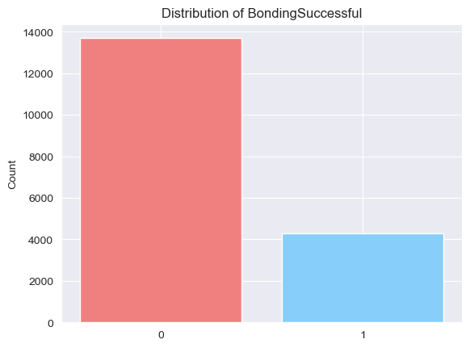
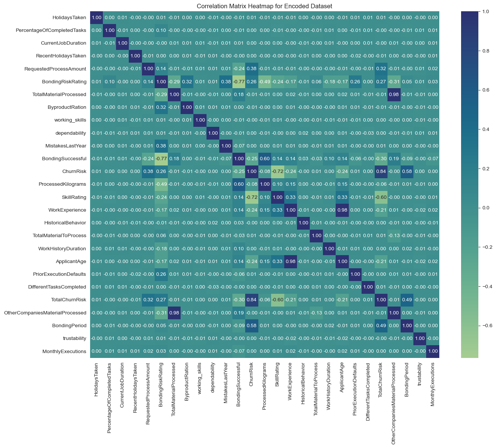
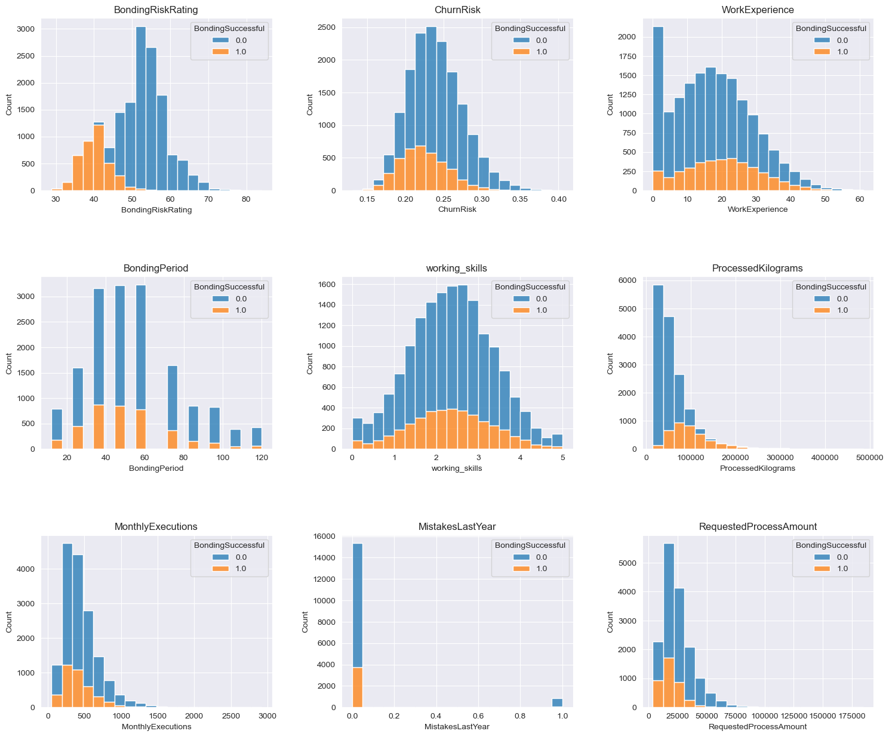
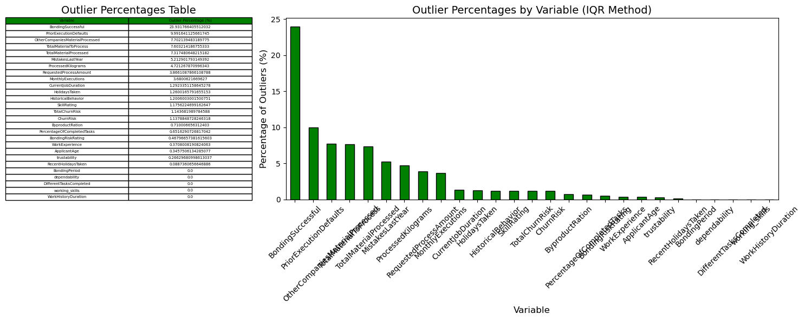
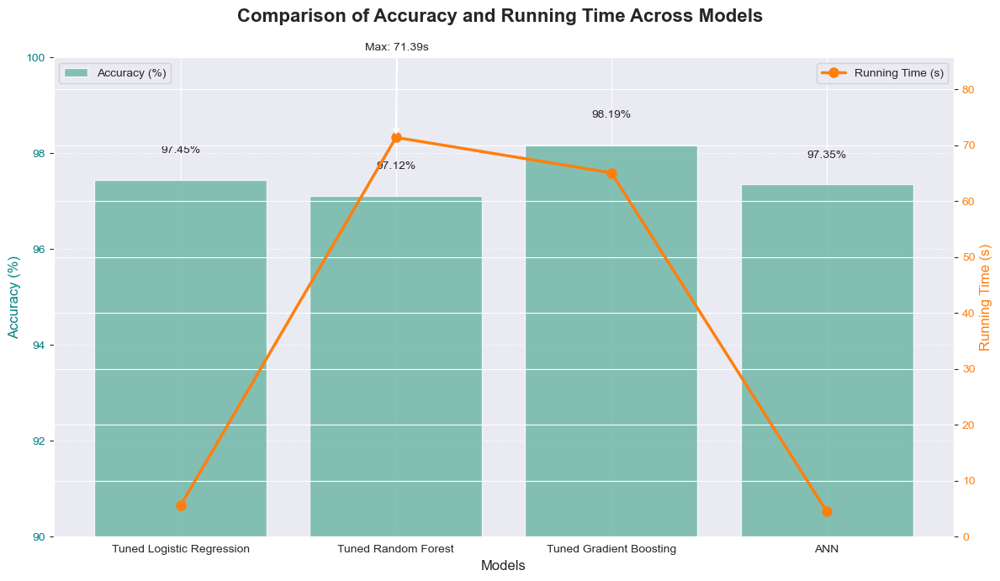
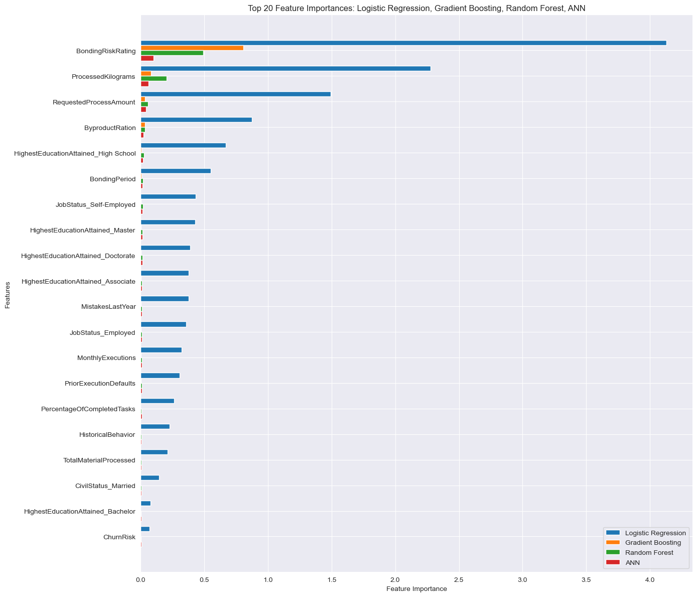

# **ARTIFICIAL INTELLIGENCE & MACHINE LEARNING PROJECT** 

Welcome to the report to our AI & ML project!  
During this report we will explain thoroughly the thought process that went behind the choices and insights we exploited and deepened in these months of hard work.

We will follow this order:
1. Introduction to the dataset
2. Dataset's analysis
3. Problem set up
    - Pre-processing data
4. Training and testing ML models
5. Conclusions

 

## *1. Introduction to the dataset*

The .csv file *Aerogel Bonding* has served as source to the data employed in our project.  
The goal of this dataset is to provide the user with information about features of a **bonding** used in a wide range of industrial applications, from the building of aerospace structures to solid-state batteries; these features refer mainly to how the bonding behaves during certain circumstances and according to the workers whom managed it.  
The primary goal is to determine whether the bonding process, indicated by the binary target variable `BondingSuccessful` (1 for success, 0 for failure), is ready for commercialization.

On the technical side the dataset consists of **31 columns by 20.000 rows**.  
Specifically, each row represents a bonding attempt, with columns describing key features such as employees' conditions, material properties, and process parameters.

## *2. Dataset's analysis*

#### A) Data overlook
By loooking at a sample of the dataset, one immediately notices how variegated the data are: we found values missing, others out of scale, binary variables for tests conducted on the bonding and some categorical ones describing employees.
These are the **types of data:**
- **Numerical columns**: examples include `ApplicantAge`, `TotalMaterialProcessed` and `BondingPeriod`
- **Categorical columns**: examples include `CivilStatus` and `HighestEducationAttained`
- **Date columns**: examples include `ProcessingTimestamp`

#### B) Data analysis
We started our data analysis plotting the distributions to both numerical and categorical features. Other than a few variables (i.e., `PriorExecutionDefaults`, `MistakesLastYear`) showing side-skewness because of outliers and/or scaling, we noticed that our target variable was completely imbalanced:

as you can see the unsuccessful cases count up to almost 14.000 cases against the 4.000 of successful ones.  
In order to balance this asymmetry we used a rather rational approach which prioritized retaining informative rows while reducing redundancy. We proceeded as follows: we introduced a variable called `MissingValuesCount` to quantify the count of missing entries in a row. By doing so, we can filter, in a selective manner, the rows in the majority class (unsuccessful cases) by eliminating those with a higher count of missing values. In order not to compromise excessively the dataset, we used the a 3:2 ratio between the failure and success. As per expectation, the approach balanced quite efficiently while addressing bias within the model for this dataset during model training.  
Using this simple yet effective technique we were able to achieve high accuracy scores when testing models for both classes(0.0 and 1.0) of our target binary variable `BondingSuccessful`.

 

To continue with our dataset's analysis we plotted the **correlation matrix** to begin investigating how features are connected among eachother.

The correlational heatmap describes the linear relationship between numerical features on a scale from -100 to +100: the higher the value, the higher the correlation, either positive or negative.  
Through correlations we understood which variables were the most related to the target one. It is also common practice to drop features with high correlations within eachother: this is to reduce noise and to restrict model testing solely on the variables that may bring added value to the final evaluation. 
In our case, we ended up eliminating from the dataset 6 variables which had either positive or negative correlation above 60%; a different case was for `ProcessingTimestamp`: it was an unanimous decision to drop it as we believed it was a complicated feature to interpret, let alone useful to our ultimate goal.

 

Finally, we would like to bring your attention to the series of histograms which plot key variables onto the target one.

The histogram grid presents the distribution of some features in the dataset, comparing their values for successful and unsuccessful bonding outcomes. Clear patterns emerge for key variables such as `BondingRiskRating` and `ChurnRisk`, where successful bonding is concentrated within specific ranges. These insights indicate that bonding success is not random but influenced by identifiable factors, suggesting the possibility of predictability. This predictability is crucial for determining whether bonding processes can be optimized and scaled commercially.  
For instance, the feature `ProcessedKilograms` shows that unsuccessful bonding is more frequent at a higher number of tries, while successful outcomes tend to cluster at lower levels. Similarly, `MonthlyExecutions` and `MistakesLastYear` display trends that can guide quality control and operational thresholds.

## *3. Problem set-up*

#### A) Handling missing values and outliers
Exploratory Data Analysis (EDA) has been a crucial step in understanding the structure, quality, and patterns in the dataset, as it layed the foundation for effective preprocessing and modeling. Through EDA, we identified missing values, outliers, and feature relationships, which were essential for informed decision-making.

*_Missing values_*: we started by understanding the total count using `ds.isnull().sum` and plotting the heatmap for these anomalies, revealing an incredibly even spreading of missing values. Using the Pipeline, we decided to impute missing values differently for categorical and numerical variables.
- **Median** imputer for numerical variables &rarr; we went for this strategy as it works best for continuous variables when they show significant skewness, and we happen to have several highly skewed features.
Being robust to extreme values was another characteristic that we needed because we did not remove any
- **Mode** imputer for categorical variables &rarr; here it was rather a natural choice as filling with the most frequent value preserve's the feature's original distribution

We ended up choosing these two methods due to the fine equilibrium achieved between efficiency and complexity. Eventually, other methods like KNN-imputer would have introduced computational overhead, as well as complicating interpretability and overfitting the dataset.

*_Outliers Removal_*: we detected outliers for numerical columns using the IQR method (Interquartile Range) which calculates the difference between the third and first quartiles. This was the situation:

  

as you can see, it isn't dramatic. Besides the target variable, the highest outliers percentage is still below 10%.  
Facing this situation we could've either remove extreme values exclusively from `BondingSuccessful`, remove them from every feature or don't remove them at all. Spoiler: we went for the third, but let us explain why.
- The first choice was likely to lead to an incomplete treatment, possibly degenerating to an even more accentuated imbalance
- Choosing the second, especially for our industrial-style dataset, meant losing valuable information as outliers often represent anomalies or rare events

To wrap-up, we believed that rather than removing those values, it would've been better to deploy machine learning models that are allegedly "immune" to the presence of outliers, thus reducing preprocessing effort and the risk of training those models on a biased dataset. Finally, getting rid of extreme values would've reduced the size of the dataset further than we wanted since we'd already dropped a significant number of columns.

#### B) Scaling and Encoding
*_Scaling_*: using the Pipeline tool we scaled our data according to **StandardScaler**. This technique suited best our case as we had a mix of long-range features (e.g., `ProcessedKilograms`) and short-range ones (e.g., `HolidaysTaken`); standard scaler ensured all features had the same mean (0) and standard deviation (1), making them comparable.
This approach also helped most with models like Logistic Regression and ANNs as they rely on distance-based calculations.

*_Encoding_*: we encoded categorical variables using **OneHotEncoder**. This tool transforms a categorical feature into a series of binary columns, one for each unique category. For each row in the dataset, a `1` is placed in the column corresponding to its category, while all other columns for that row are set to `0`.  
We also printed the columns that were created after this step. The use of one-hot encoding ensures that no ordinal relationship is assumed between the categories. For example, `Employed`, `Self-Employed`, and `Unemployed` are treated as distinct, without implying a hierarchy or ranking.  
The dataset now has 12 additional columns.

## *4. Training and testing ML models*
We were required to experiment with at least 3 models for our *Classification* problem to find out which one works better on our dataset. Classification is a supervised learning task where a model learns to predict categories based on labeled data. Typically, the dataset is split into a training set, used to train the model, and a testing set, used to evaluate its performance on unseen data, ensuring generalization.  
The models we chose are **Logistic Regression**, **Random Forest** and **Gradient Boosting Trees**; we also had fun with building and testing an **Artificial Neural Network**.  
To evaluate the performance of each model we used the following metrics:
- *Accuracy* &rarr; it measures the proportion of correctly predicted instances out of all instances
- *Precision* &rarr; it shows the proportion of correctly predicted positive instances out of all predicted positives
- *Recall* &rarr; it indicates how well the model identifies all relevant positive instances
- *F1-score* &rarr; the harmonic mean of precision and recall, balancing both metrics

Every model has been compared mainly on the basis of the *accuracy* score, evaluated on both the minory and majority classes.

### **Logistic Regression** 
Logistic regression is a linear model used for classification and it works as follows:

1. **Input features**: it takes numerical input features and combines them using a weighted linear equation
2. **Activation function**: the linear combination is passed through the Sigmoid function to map it to a probability of value (*y*) between 0 and 1
3. **Prediction**: the probability output *y* is then used to classify the input. A threshold (e.g., alpha) is used:
    - if *y* >= alpha, classify as `1`
    - if *y* <= alpha, classify as `0`
4. **Output**: the final model predicts the probability of the positive class and classifies the data accordingly

The tuned model turned out to be slightly better in *accuracy* with respect to the base model:

| Model                  | Accuracy | 0.0 Precision | 0.0 Recall | 0.0 F1 | 1.0 Precision | 1.0 Recall | 1.0 F1 | Running Time (s)
|------------------------|----------|---------------|------------|--------|----------------|------------|--------|------------------
| Tuned Logistic Regression | 97.45%   | 97.09%        | 98.78%     | 97.93% | 98.04%         | 95.35%     | 96.68% | 3.79

Overall, Logistic Regression proved to be a solid machine learning model. The binary target variable and its balancing definetely helped at achieving these results; every experiment conducted prior to finding the right equilibrium always yielded worse performances, demonstrating how crucial it was to properly treat `BondingSuccessful`.

---

### **Random Forest**
Random Forest is an ensemble model used for classification. Let us tell you how it operates with a few steps:

1. **Data sampling**: multiple subsets of the training data are created; each subset is then used to train a separate decision tree through bootstrapping (a technique which randomly samples with replacement)
2. **Tree construction**: for each decision tree, only a random subset of features is considered, promoting diversity among trees. Moreover, each one of them is grown independently and up to its maximum depth
3. **Voting**: each tree casts a vote for a class and the majority class is chosen as the final prediction
4. **Error Estimation**: beacause of step 1, about one-third of the data are left out. These samples are used to estimate model accuracy

Here we succeeded in improving the accuracy score with the tuned model.

| Model              | Accuracy | 0.0 Precision | 0.0 Recall | 0.0 F1 | 1.0 Precision | 1.0 Recall | 1.0 F1 | Running Time (s)
|--------------------|----------|---------------|------------|--------|----------------|------------|--------|----------------
| Tuned Random Forest | 97.12%   | 97.07%        | 98.25%     | 97.66% | 97.21%         | 95.35%     | 96.27% | 67.47

The Random Forest model fared well on this dataset due to its ensemble nature. However, the same nature makes it prone to overfitting while retention of outliers and balancing the target variable were indispensable in maintaining reasonable dataset size. This was fine-tuned further by tuning, giving it even more accurate precision and recall. And though it did not perform better than the Gradient Boosting, its interpretability and identification of key features make it fairly reliable.

---

### **Gradient Booosting Trees**
Gradient Boosting Trees work by building an ensemble of decision trees sequentially, with each tree improving the previous. This is how it works:

1. **Model initialization**: usually a simple model which typically predicts a probability for the target variables is initiated
2. **Error computation and new initialization**: the errors of the current model's prediction are computed; these errors state what the model still needs to learn.  
A new decision tree is trained (typically called *weak learner*) to predict the residuals from the current model
3. **Model update**: the predictions from the new tree, weighted by a learning rate, are added to the existing model
4. **Iteration**: steps 2 and 3 are repeated until a stopping criterion is met (e.g., a fixed number of trees or no improvement)
5. **Final Prediction**: all predictions from every tree are combined to determine the final one

Gradient Boosting was also a model which improved after hyperparameter tuning.

| Model                  | Accuracy | 0.0 Precision | 0.0 Recall | 0.0 F1 | 1.0 Precision | 1.0 Recall | 1.0 F1 | Running  Time (s)
|------------------------|----------|---------------|------------|--------|----------------|------------|--------|-------------------|
| Tuned Gradient Boosting | 98.19%   | 98.41%        | 98.63%     | 98.52% | 97.85%         | 97.50%     | 97.67% | 62.47

This model showed far the highest accuracy for this dataset, hence showing its full ability in catching complex nonlinear interactions among features. Being iterative allows it to correct the error made by previous trees in every step with a refined prediction. This is further tuned and enhanced by the optimization of parameters such as the learning rate and tree depth, which helped to avoid overfitting while maintaining high predictive power.

---

### **Artificial Neural Network (ANN)**
An ANN is conceived as a replica to the way biological brains process information. It can have very complex architectures. Here is a common one:

1. **Input layer**: the network is given input data, with features fed into the first dense layer
2. **Hidden layers**:
    - **Dense layers** &rarr; these apply learned weights and biases to the input data, followed by an activation function to introduce non-linearity
    - **Dropout layers** &rarr; these layers randomly turn-off neurons during training to prevent overfitting
3. **Output layer**: the final dense layer outputs the whole network's prediction (in our case a single value)
4. **Training**: the network is trained according to the minimization of the loss function between predictions and true labels, using backpropragation and known algorithms like gradient or stochastic descent

In our particular build we added two hidden layers with 64 and 32 neurons, followed by dropout layers for regularization. It concludes with an output layer for the binary classification output (indicated by the single output neuron). These were the overall scores:

| Model                  | Accuracy | 0.0 Precision | 0.0 Recall | 0.0 F1 | 1.0 Precision | 1.0 Recall | 1.0 F1 | Running Time (s)
|------------------------|----------|---------------|------------|--------|----------------|------------|--------|--------------------|
| Artificial Neural Network (ANN) | 97.45%   | 97.30%        | 98.56%     | 97.92% | 97.69%         | 95.71%     | 96.69% | 5.65

The ANN performed very well, and its accuracy was almost at the level of the best models. Its strength in learning non-linear patterns helped it perform outstandingly, even on a dataset not so perfect for neural networks due to its relatively small size. Keeping the outliers and balancing the target variable, ANN was able to generalize well without overfitting. While less practical for its interpretability and for more computational demands associated with it in comparison to simpler models such as Gradient Boosting, the ANN indeed proved itself in sophisticated feature relationships.

---

Finally, it is clear that the **Tuned Gradient Boosting** is superior: it can generate high accuracy, about 98.19%, considering a feasible execution time. Compared with ANN being, together with Logistic Regression, optimally fast at slightly lower accuracy and Random Forest much slower and not that precise, the Gradient Boosting algorithm provided just the perfect mix between good results and sufficient computational performance for any given computational equipment and proved the most robust choice.

## 5. *Conclusions*
The analysis of the bonding process has provided valuable insights into its potential for commercialisation, highlighting both its promise and the significant challenges that remain to be addressed. While rigorous testing and model evaluation have demonstrated that, when balanced, the predictive models achieve remarkably high accuracy scores, this does not fully translate into readiness for effective implementation. The underlying imbalance in the target variable, `BondingSuccessful`, presents a critical obstacle, as it may lead to unreliable performance in unbalanced, real-world scenarios.

The big class imbalance in the original dataset does point to a key challenge. Although balancing allowed for robust training and testing of models, such 'preferential' treatment is usually not provided in real-life scenarios. This might lead to over-representation of failures and under-recognition of successful cases in operational settings. Therefore, impressive accuracy metrics in testing need to be reduced to their context.

What we highlighted during the EDA and the feature importance has at last turned out to be crucial to estimate key drivers for the success of the bonding process:
- Among these, **`BondingRiskRating` was the most relevant variable**, highlighting the need for risk reduction.
- Similarly, features like `ProcessedKilograms` and `RequestedProcessAmount` are indicative of thresholds beyond which significant drops in success rates occur. Smaller processed volumes (< 100,000 kg) tend to be associated with successful bonding, while failures increase with larger batches
- Secondly, the interaction of variables such as `ProcessedKilograms`, `MonthlyExecutions`, and `RequestedProcessAmount` shows that, for any increase in the success rate, proper balancing needs to be made between high-volume operations with control on the quality aspects
- Another key insight regards workforce characteristics. Bonding is most successful among individuals with moderate work experience. Very low experience (< 5 years) may indicate a lack of requisite skills, while very high experience (> 30 years) may be associated with decreasing performance over time. This trend highlights the need to strike a balance in workforce composition to ensure optimal outcomes

Wrapping up, we found that scalability will definitely become an issue towards success. Moreover, maintaining equilibrium between operational scale and quality control, as well as finding the right balance in workforce composition frame perfectly our concept of a product ready for the market.

Concretely, this is what we suggest improving:
1. **Operational and Procedural Refinements**:
    Risk mitigation through improved material selection, refining process durations based on historical success rates, and development of the workforce will be key components of scalable success.
2. **Real Time Monitoring**:
    Real-time monitoring of critical variables such as `BondingRiskRating` could provide opportunities for early interventions to prevent failures before they actually happen.

The project underlines the transformative potential of predictive modeling within complex industrial processes. It does, however, highlight a key consideration in siting model performance within real-world constraints such as class imbalance and operational variability. This leads to the final conclusion that though there is great potential for commercialization, this bonding process would indeed have to be pursued in a very measured and iterative manner. Still, by following the lead offered by our improvements the bonding process will definetely transition to a next level, from an interesting prototype into a truly robust and commercially scalable solution. This will not only improve operational efficiency but also set a framework for leveraging predictive analytics.

 
Thank you for you're attention. We hope you enjoyed as much as we did!
 
 
 

#### Written with 🧠 by:
- **Federico Pallesi 291291**
- **Riccardo Baldini 299021**
- **Andrea Goberti 306351**