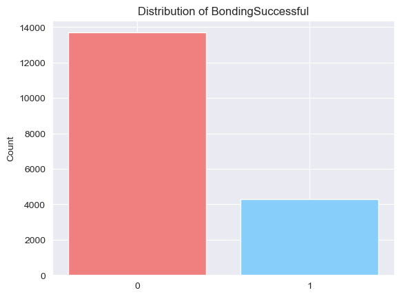
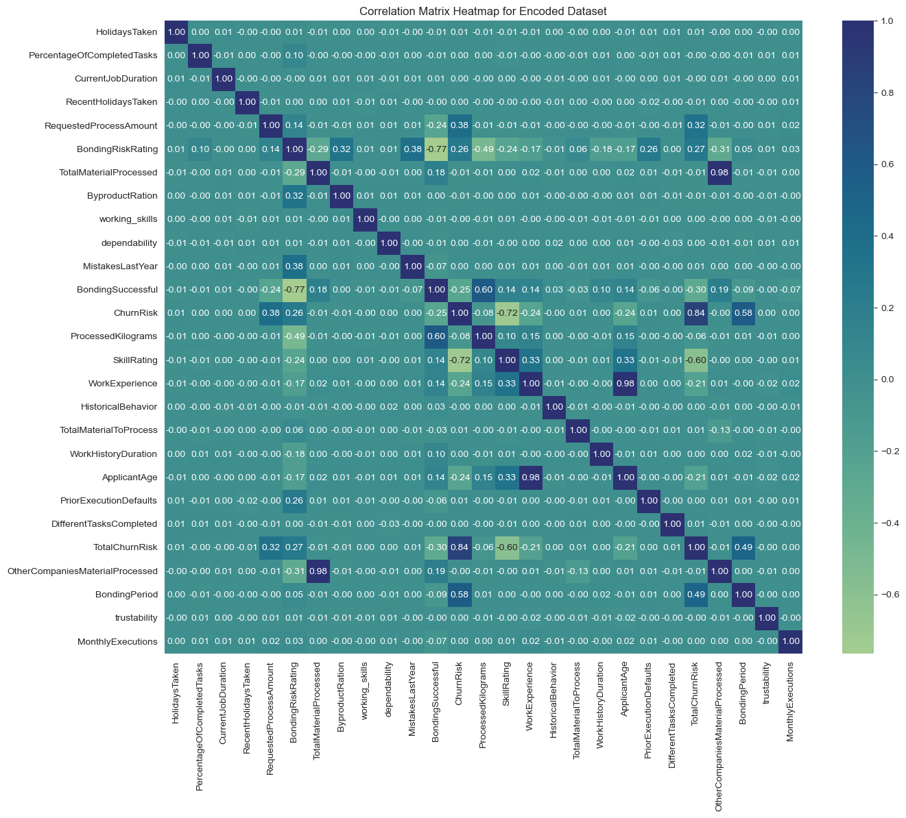
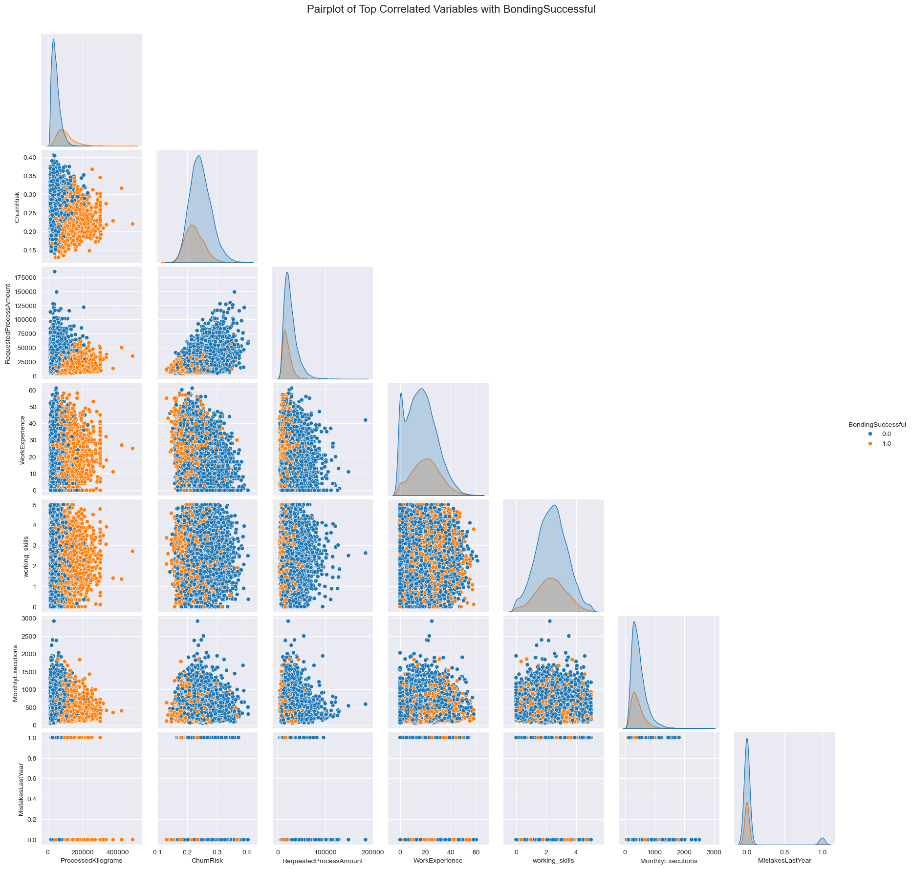

# **ARTIFICIAL INTELLIGENCE & MACHINE LEARNING PROJECT** 

Welcome to the report to our AI & ML project!  
During this report we will explain thoroughly the thought process that went behind the choices and insights we exploited and deepened in these months of hard work.

We will follow this order:
1. Introduction to the dataset
2. Dataset's analysis
3. Problem set up
    - Pre-processing data
4. Training and testing ML models
5. Conclusions

 

## *1. Introduction to the dataset*

The .csv file *Aerogel Bonding* has served as source to the data employed in our project.  
The goal of this dataset is to provide the user with information about features of a **bonding** used in a wide range of industrial applications, from the building of aerospace structures to solid-state batteries; these features refer mainly to how the bonding behaves during certain circumstances and according to the workers whom managed it.  
The primary goal is to determine whether the bonding process, indicated by the binary target variable `BondingSuccessful` (1 for success, 0 for failure), is ready for commercialization.

On the technical side the dataset consists of **31 columns by 20.000 rows** at maximum.  
Specifically, each row represents a bonding attempt, with columns describing key features such as employees' conditions, material properties, and process parameters.

## *2. Dataset's analysis*

#### A) Data overlook
By loooking at a sample of the dataset, one immediately notices how variegated the data are: we found values missing, others out of scale, binary variables for tests conducted on the bonding and some categorical ones describing employees.
These are the **types of data:**
- **Numerical columns**: examples include `ApplicantAge`, `TotalMaterialProcessed` and `BondingPeriod`
- **Categorical columns**: examples include `CivilStatus` and `HighestEducationAttained`
- **Date columns**: examples include `ProcessingTimestamp`

#### B) Data analysis
We started our data analysis plotting the distributions to both numerical and categorical features. Other than a few variables (i.e., `PriorExecutionDefaults`, `MistakesLastYear`) showing side-skewness because of outliers and/or scaling, we noticed that our target variable was completely imbalanced:

as you can see the unsuccessful cases count up to almost 14.000 case against the 4.000 of successful ones.  
In order to treat this accordingly we decided to use the SMOTE (Synthetic Minority Oversampling Techinque): it works by selecting k-nearest neighbors for the minority class first, then it creates synthetic samples by interfacing with the selected instance and its k-neighbors, and finally adds these sample to the dataset to balance distribution.  
Using this simple yet effective technique we were able to achieve high accuracy scores when testing models for both classes(0.0 and 1.0) of our target binary variable `BondingSuccessful`.

 

To continue with our dataset's analysis we plotted the **correlation matrix** to begin investigating how features are connected among eachother.

This tool turned out to be crucial to decide which variables to drop. Indeed, we ended up eliminating from the dataset 5 variables which had either positive or negative correlation above 60%; you'll notice that we dropped also `ProcessinTimestamp`: this was an unanimous decision, as we believed it was a complicated feature to interpret, let alone useful to our ultimate goal.

 

Finally, we would like to bring your attention to the pairplot which considers plots key variables on the target one.

This plotting reveals some interesting insights which may help drive the change for imrpovement before commercializind the bonding.

## *3. Problem set-up*

#### A) Handling missing values and outliers
Exploratory Data Analysis (EDA) is a crucial step in understanding the structure, quality, and patterns in the dataset, as it lays the foundation for effective preprocessing and modeling. Through EDA, we identify missing values, outliers, and feature relationships, which are essential for informed decision-making.
In this section, we utilized Python libraries such as **Pandas** for data manipulation, **Matplotlib** and **Seaborn** for visualization, and **NumPy** for numerical operations. These tools allowed us to gain meaningful insights into the dataset's characteristics efficiently.

*_Missing values_*: we started by understanding the total count using `ds.isnull().sum` and plotting the heatmap for these anomalies, revealing an incredibly even spreading of missing values.